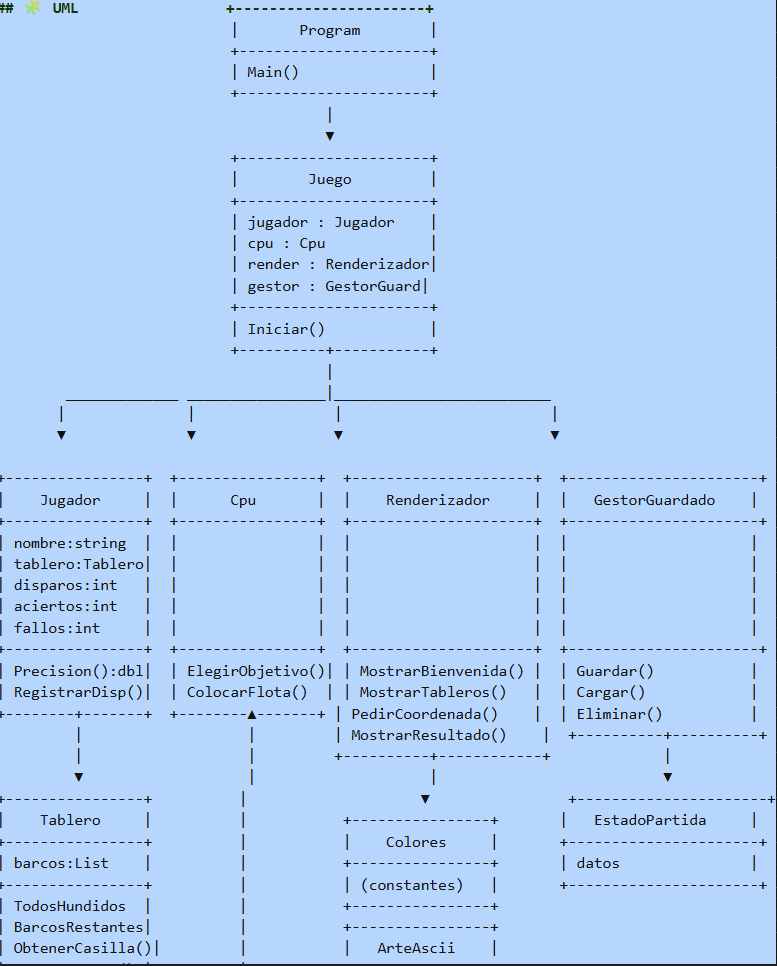
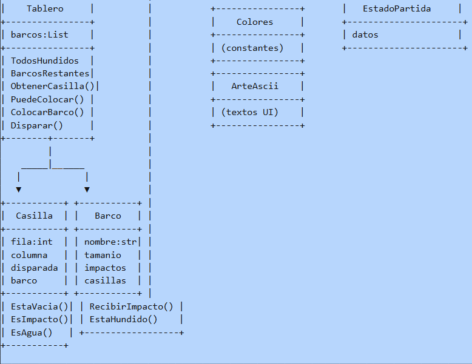

# PROYECTO-POO-AV2
# 🚢 Hundir la Flota
## 📌 Descripción
Juego de estrategia por turnos en consola desarrollado en C#.

## 🧩 UML                

## 🚢 Flota
- Portaaviones (5)
- Acorazado (4)
- Destructor (3)
- Submarino (3)
- Patrullera (2)

## 🎮 Mecánicas
- Turnos alternos
- Disparos por coordenadas
- Resultados: Agua, Impacto, Hundido

## 📜 Reglas
- No se permiten barcos en diagonal
- No pueden tocarse
- Tablero 10x10